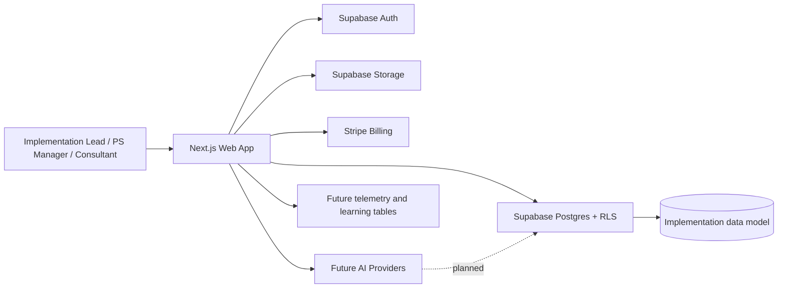

# Implementation Pro - Architecture and Development Plan

**Version:** 3.0  
**Date:** March 31, 2026  
**Status:** Current-state architecture plus target-state development plan  
**Owner:** John Swapp

## 1. Purpose

This document explains how the current repository is structured, what is already implemented, what is only modeled in schema or planning, and how the product should be built forward.

The core rule is the same as in the PRD: if the repository does not prove a capability exists, it is marked as planned, not shipped.

## 2. Architecture Method

This plan uses three standard architecture lenses:
- C4-style structure for system context, containers, and key components
- cloud well-architected thinking for reliability, security, cost, operations, and performance
- explicit separation between current state and target state

### Why this matters
Implementation Pro is not a generic CRUD app. It is a multi-tenant workflow product with billing, delivery operations, and future AI execution. The architecture must keep those concerns isolated while still allowing the product to grow into AI-assisted delivery.

## 3. Current State Summary

### What is confirmed in code now
- Next.js app router application
- Marketing homepage
- Supabase auth integration
- Login, signup, and auth callback routes
- Protected dashboard shell
- Engagement list and engagement detail routes
- Governance and AI agent placeholder screens
- Settings screen
- Stripe checkout, billing portal, and webhook routes
- Supabase server and browser clients
- Generated database types
- Supabase migration with a broad implementation data model

### What is modeled but not yet implemented as application logic
- AI agent orchestration
- risk scoring engine
- self-learning pipeline
- self-healing workflow
- report generation service
- delivery intelligence UI
- most CRUD flows beyond the current page scaffolding

### Important architectural constraint
The database schema is ahead of the UI and service layer. That is acceptable only if the product states it clearly and the roadmap closes the gap in an intentional order.

## 4. System Context

### Current context interpretation
- The browser is the primary client.
- Supabase is the current system of record.
- Stripe is the billing boundary.
- AI providers are planned integration points, not yet proven live in the reviewed code.

## 5. Container Architecture

### 5.1 Presentation layer
The app uses Next.js App Router routes for:
- marketing pages
- auth pages
- protected dashboard pages
- API routes for billing

Confirmed routes:
- `/` marketing home
- `/login`
- `/signup`
- `/callback`
- `/engagements`
- `/engagements/[id]`
- `/governance`
- `/agents`
- `/settings`
- `/api/stripe/checkout`
- `/api/stripe/portal`
- `/api/stripe/webhook`

### 5.2 Application layer
The app currently contains:
- server-side Supabase client helpers
- browser-side Supabase client helper
- React Query provider
- simple shared utility functions
- layout and navigation components
- tabbed engagement placeholder component

### 5.3 Data layer
Supabase Postgres is the canonical data layer.
The migration already models:
- tenants and users
- engagement delivery objects
- billing and financial objects
- governance and risk objects
- AI agent objects
- learning and healing objects

### 5.4 External services
Confirmed in code:
- Supabase Auth and Postgres
- Stripe billing

Planned or implied by docs but not found as live code in the review:
- email delivery provider
- AI model provider integration
- telemetry and error monitoring service

## 6. Current Technology Stack

Confirmed by package.json and source files:
- Next.js 16.2.1
- React 18.3.1
- TypeScript 6
- Tailwind CSS 3.4.17
- Supabase SSR and Supabase JS
- Stripe
- TanStack React Query
- Zod
- lucide-react
- react-hook-form
- class-variance-authority, clsx, tailwind-merge

### Stack note
The README still describes an older stack shape in places. This architecture plan treats the package and source code as the source of truth.

## 7. Data and Tenancy Model

### Tenancy model
Each organization owns its own working set:
- engagements
- scope items
- stakeholders
- decisions
- RACI entries
- checklists
- reports
- billing state
- governance objects
- AI logs
- learning context
- healing events

### Core tenancy rule
All product data must remain organization-scoped. Cross-tenant access should only happen through admin or service-role operations that are tightly controlled and auditable.

### Most important tables for the current product
- organizations
- org_members
- engagements
- scope_items
- stakeholders
- decisions
- raci_items
- checklist_items
- lessons_learned
- status_reports
- financial_tracking
- compliance_rules
- compliance_violations
- project_plans
- risk_signals
- client_updates
- delivery_signals
- agent_definitions
- agent_tasks
- agent_executions
- agent_artifacts
- learning_feedback
- org_learning_context
- outcome_correlations
- system_health_checks
- self_healing_events
- error_patterns

## 8. Security Architecture

### Current security controls
- Supabase auth gates protected routes
- Server-side Supabase client for sessions and auth checks
- Browser-side Supabase client for client interactions
- Stripe webhook signature validation
- Service role usage is isolated to the webhook route

### Required security controls for production
1. All organization data must be protected by RLS.
2. Server-only secrets must remain outside the browser bundle.
3. Billing webhooks must be idempotent.
4. AI outputs must be stored with provenance and review state.
5. Any future autonomous action needs a policy boundary and audit trail.

### AI-specific security policy
AI should never receive more context than is needed for the task.
AI-generated content should be visible, editable, and attributable.
High-risk operations should remain propose-and-wait until trust is earned.

## 9. Quality Attributes

### Reliability
- The app should survive auth failures, billing failures, and empty data.
- Critical routes must fail gracefully.
- Future AI executions must support retries and fallbacks.

### Security
- Tenant isolation is mandatory.
- Billing and auth flows must be validated server-side.
- AI data access must be least-privilege.

### Cost optimization
- The current stack is intentionally lean.
- AI usage must be metered per execution once live.
- Paid plans should map to measurable usage limits.

### Operational excellence
- Schema changes should be migration-based and reviewable.
- Release steps should be scripted.
- Production incidents should be observable and actionable.

### Performance efficiency
- Engagement and dashboard queries should use indexes.
- Data should be loaded at the server where possible.
- Lists should paginate before they become heavy.

## 10. Target Architecture for the AI Layers

The current repository already models AI layers in the schema, but the service layer is not yet present. The target design should look like this:

1. Trigger - user action, schedule, or threshold event
2. Context assembly - pull engagement data, org preferences, and recent history
3. Agent execution - run a typed task against a specific schema
4. Review - human approves, edits, or rejects
5. Commit - approved output becomes a first-class artifact
6. Learn - feedback and outcome data update org-specific context

### Target agent boundary
- Advisory: surface risks and suggestions
- Draft: create output for review
- Supervised: execute low-risk tasks with override capability
- Autonomous: only for very low-risk actions after trust is earned

### Target agent components
- agent registry
- task queue or scheduling layer
- execution log
- artifact store
- review UI
- feedback capture
- learning update job
- health and retry policy

## 11. Development Plan

## 11.1 Workstream 1 - Foundation hardening
Goal: make the current scaffold reliable and truthful.

Deliverables:
- clearer landing page messaging
- working auth flows
- better protected-route behavior
- accurate plan display
- better empty states
- error states that explain what failed
- tenant-aware navigation

Exit criteria:
- a new user can create an account, log in, and understand the next step without confusion

## 11.2 Workstream 2 - Core workspace CRUD
Goal: turn the engagement shell into a real operating system.

Deliverables:
- organization setup
- membership management
- engagement create/edit/delete
- scope item CRUD with MoSCoW
- stakeholder CRUD
- decisions log
- RACI editor
- kickoff and go-live checklists
- lessons learned capture
- status report creation and history

Exit criteria:
- an implementation lead can manage a live engagement in the app without leaving it for core records

## 11.3 Workstream 3 - Billing and entitlement enforcement
Goal: make pricing real.

Deliverables:
- Stripe price IDs wired cleanly
- plan mapping in the app
- upgrade and billing portal UX
- webhook-driven plan updates
- free, Pro, and Team limits enforced in UI and server logic
- enterprise treated as future or custom until supported explicitly

Exit criteria:
- billing state in the UI matches Stripe state and plan entitlements

## 11.4 Workstream 4 - Delivery governance
Goal: make engagement health measurable.

Deliverables:
- project plan generation
- delivery signal capture
- health history timeline
- risk signals with evidence
- client update drafts
- explainable health score

Exit criteria:
- the product can explain why an engagement is healthy, yellow, or red

## 11.5 Workstream 5 - AI execution layer
Goal: add reviewable, useful AI work products.

Deliverables:
- agent definitions with typed schemas
- agent task creation and scheduling
- execution logs with token and cost tracking
- artifact storage and approval states
- feedback capture on edits and rejections
- per-org learning context

Exit criteria:
- every AI output has provenance, review status, and a feedback loop

## 11.6 Workstream 6 - Self-learning and self-healing
Goal: improve quality and resilience over time.

Deliverables:
- outcome correlation tracking
- recommendation tuning
- system health checks
- self-healing event logging
- error pattern tracking
- retry and fallback policies

Exit criteria:
- the system gets better because of actual usage signals, not hand-waving

## 12. Deployment and Runtime Plan

### Current deployment posture
The README positions Vercel as the deployment target.
The app is structured like a Vercel-friendly Next.js deployment.

### Recommended runtime pattern
- server-rendered pages for authenticated data views
- route handlers for billing and server-only operations
- Supabase as managed backend
- environment variables for all secrets
- no business logic in client components that can be enforced on the server

### Required environment controls
- Supabase URL and anon key
- Supabase service role key for server-only routes that need it
- Stripe secret key
- Stripe webhook secret
- app URL for redirects

## 13. Testing and Engineering Gates

There are no repository test files yet. That is a real gap and should be closed early.

Minimum quality gate for any new production feature:
- lint
- type check
- build
- route-level manual verification
- desktop and mobile responsive verification
- negative-path verification for auth, empty states, and billing

For AI features, add:
- schema validation
- prompt/output contract tests
- retry behavior tests
- human review workflow tests

## 14. Risks and Mitigations

### Risk 1 - Schema ahead of product
Mitigation: gate roadmap claims to shipped behavior only and build the CRUD layer before the AI layer.

### Risk 2 - Billing drift
Mitigation: treat Stripe plan state as the source of truth and sync it through webhooks only.

### Risk 3 - Overpromising AI
Mitigation: label AI features as proposed until live, and keep review in the loop for all client-facing output.

### Risk 4 - No test suite
Mitigation: add tests before the next major feature branch and make them part of release gating.

### Risk 5 - Tenant isolation mistakes
Mitigation: keep RLS first-class, avoid direct admin shortcuts in app code, and audit server role usage.

## 15. Open Architecture Decisions

These are not resolved by the repository and should be decided before broad rollout:
- Which AI provider is primary for production agent work?
- Which email provider is the canonical transactional path?
- Will enterprise billing be custom quotes, self-serve, or both?
- Will agents run via queue, cron, event triggers, or a mix?
- What is the minimum trust threshold for supervised automation?

## 16. Architecture Decision Summary

The right architecture for Implementation Pro is not microservices first. It is a disciplined, modular monolith with a managed backend, clear tenancy boundaries, and a future-ready AI execution layer.

That approach fits the repository state now and preserves room for future agent execution without forcing premature platform complexity.
